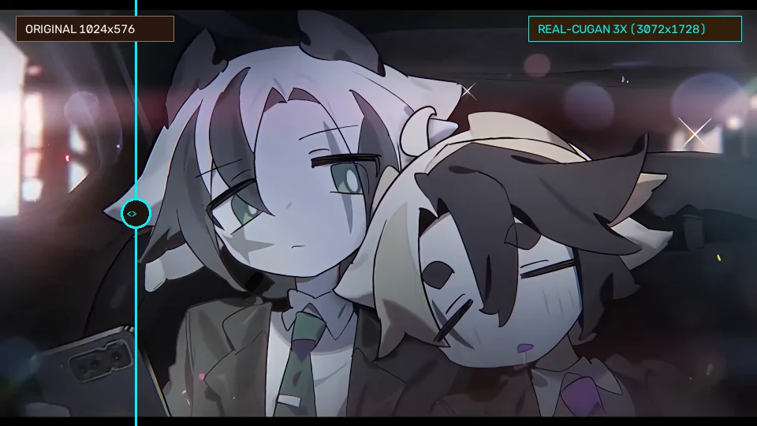
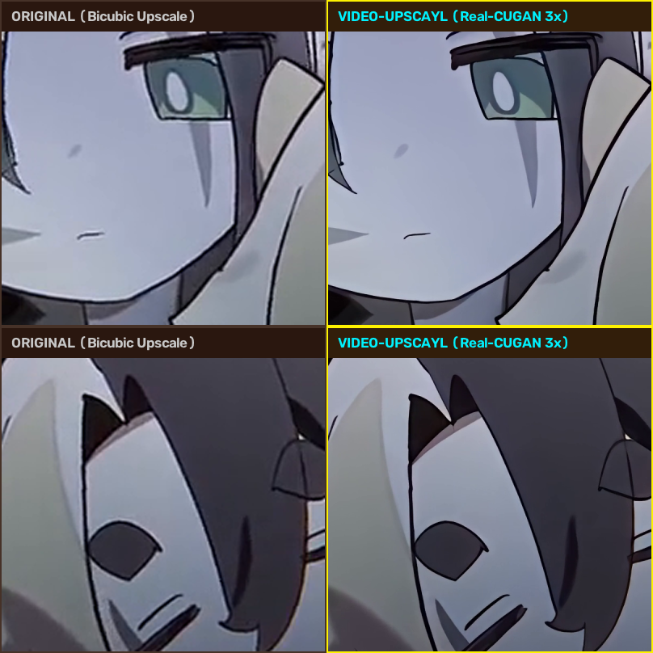

# Video-Upscayl

Video-Upscayl is a hardware-accelerated video super-resolution tool designed to upscale videos using neural network models. It pairs a high-performance C++ Vulkan/SIMD native backend with an intuitive desktop GUI and feature-rich CLI.

<div align="center">

### 🎬 Interactive Before & After Video Comparison

[](docs/index.html)
[](#features)
[](#supported-models)

<br/>

<!-- Hero Animation: Sweeping Before/After Split-Screen Comparison -->
<p align="center">
  
  <br/>
  <em>Live split-screen wipe: Original 1024×576 (Left) vs. Video-Upscayl 3x Real-CUGAN Pro 3072×1728 (Right)</em>
</p>

</div>

---

### 🔍 Pixel-Level Quality Inspection (3x Super-Resolution)

Compare fine anime line-art, facial features, and compression artifact removal:

<p align="center">
  
  <br/>
  <em>Top: Character eyes & eyelashes | Bottom: Linework & soft bokeh lighting</em>
</p>

> 💡 **Try the Interactive Web Player:**  
> Run `video-upscaler demo` to open the full interactive comparison player in your browser with real-time draggable wipe sliders, synchronized dual video playback, 4x magnifier loupe, and model switching (Real-CUGAN 3x vs. Real-ESRGAN 2x). You can also open [`docs/index.html`](docs/index.html) directly or host it on GitHub Pages.

---

## Features

- Vulkan GPU Acceleration: Cross-vendor GPU support across NVIDIA, AMD, and Intel GPUs via Vulkan Compute.
- CPU SIMD Fallback: Multi-core OpenMP processing with CPU SIMD optimizations.
- Seamless Tiling: Configurable tile-based processing with overlap padding to handle high resolutions without exceeding VRAM limits.
- Audio and Metadata Preservation: Uses FFmpeg streams to preserve original audio, frame rates, and container metadata.
- Pre-Trained Super-Resolution Models: Out-of-the-box support for anime and general real-world video upscaling.
- Dual Interfaces: Choose between a desktop Graphical User Interface (GUI) and a Command Line Interface (CLI).
- Built-in Hardware Profiling: CLI commands to inspect GPU/CPU telemetry and benchmark upscale performance across devices.

## Supported Models

Models are located in the `models/` directory:

- realesr-animevideov3 (2x, 3x, 4x): Optimized for anime and 2D animation with fast inference.
- realcugan-se (2x, 3x): High-quality anime super-resolution.
- 4x-UltraSharp: General-purpose high-fidelity photorealistic upscaling.
- realesrgan-x4plus / realesrgan-x4plus-anime: General image and animation 4x models.

## Requirements

- Operating System: Linux or Windows 10/11 (64-bit)
- Python: 3.10 or newer
- FFmpeg: Must be installed and accessible in your system `PATH`
- GPU Drivers: Modern GPU driver with Vulkan 1.2+ support (for GPU acceleration)
- Build Tools (when building backend from source):
  - CMake 3.20+
  - C++17 compiler (GCC/Clang on Linux, MSVC on Windows)
  - Ninja build system
  - Vulkan SDK / headers

## Installation

1. Clone the repository:

   ```bash
   git clone https://github.com/your-repo/video-upscayl.git
   cd video-upscayl
   ```

2. Set up a Python virtual environment:

   ```bash
   python3 -m venv .venv
   source .venv/bin/activate  # On Windows: .venv\Scripts\activate
   pip install -e .
   ```

3. Build the native C++ backend:

   On Linux:
   ```bash
   bash scripts/build_backend.sh
   ```

   On Windows:
   ```cmd
   scripts\build_windows.bat
   ```

## Usage

### Graphical User Interface (GUI)

Launch the desktop application using either:

```bash
video-upscaler-gui
```

or via the CLI shortcut:

```bash
video-upscaler gui
```

### Command Line Interface (CLI)

#### Check Hardware and Vulkan Telemetry

```bash
video-upscaler info
```

#### List Available Models

```bash
video-upscaler models
```

#### Benchmark Acceleration Devices

Test inference speeds on your CPU, GPU, or Hybrid configurations:

```bash
video-upscaler benchmark --model realesr-animevideov3-x2
```

#### Launch Interactive Comparison Web Demo

Start a local web server and launch the interactive before/after video comparison player in your browser:

```bash
video-upscaler demo
```

Options:
- `--port INTEGER`: Local port to serve the demo on (default: `8000`).
- `--no-browser`: Start the local HTTP server without launching the browser automatically.

#### Upscale a Video

Basic usage:

```bash
video-upscaler upscale -i input.mp4 -o output.mp4 -m realesr-animevideov3-x2
```

Common options:

- `-i, --input PATH`: Path to source video (required).
- `-o, --output PATH`: Output video destination (auto-named if omitted).
- `-m, --model NAME`: Model to use (e.g. `realesr-animevideov3-x2`, `realcugan-se-x2`, `4x-UltraSharp`).
- `-d, --device [auto|gpu|cpu|hybrid]`: Compute device selection (default: `auto`).
- `--gpu-id INT`: Index of the GPU to target (-1 for best discrete GPU).
- `-t, --tile-size INT`: Processing tile size (default: `256`, set `0` to disable tiling).
- `--tile-pad INT`: Overlap padding in pixels (auto-detected if omitted).
- `-c, --codec CODEC`: Output encoder (e.g. `libx264`, `libx265`, default: `libx264`).
- `--crf INT`: Video quality factor (default: `18`).
- `--preview`: Render only the first 5 seconds to test settings.
- `--compare`: Generate a side-by-side before/after comparison video.

## Project Structure

```
video-upscayl/
├── backend/          # C++ native Vulkan/SIMD inference engine
├── models/           # Pre-trained model weights (.bin) and configs (.param)
├── scripts/          # Compilation, AppImage, and packaging scripts
├── third_party/      # Embedded third-party libraries (ncnn)
└── video_upscaler/   # Python CLI, GUI, and video processing pipeline
```
